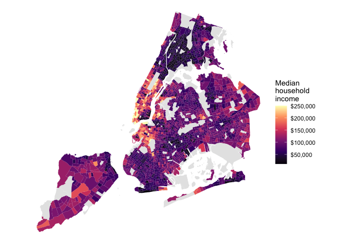

<!-- README.md is generated from README.Rmd. Please edit that file -->

# nycdemog 

<!-- badges: start -->

<!-- badges: end -->

The nycdemog package provides county-, tract-, and block-level
demographic data for the five counties of New York City, derived from
the US Census Bureau via
[tidycensus](https://walker-data.com/tidycensus/). It provides a set of
tibbles keyed by `geoid` covering race, age and sex, household
structure, income and poverty, education, employment, housing, and
language and nativity, alongside thin wrapper functions that help you
make NYC-only queries against the Census API.

The tract- and block-level datasets join 1:1 to corresponding `sf`
objects in the [nycmaps](https://github.com/kjhealy/nycmaps) package, on
the `geoid` column. The county-level datasets join to
`nycmaps::nyc_boros_sf` on the `county` column, which matches
`nycmaps::nyc_boros$short_county_name`.

## Installation

You can install the development version of nycdemog from
[GitHub](https://github.com/) with:

``` r
# install.packages("pak")
pak::pak("kjhealy/nycdemog")
```

The pre-built data tables are in the package. The wrapper functions pull
from the Census API and require you have a [Census API
key](https://api.census.gov/data/key_signup.html), set as the
`CENSUS_API_KEY` environment variable.

## Stored datasets

Every shipped tibble has `geoid` and `county` as its first two columns.
ACS estimates have `_moe` margin-of-error columns.

``` r
library(tibble)
library(nycdemog)

nyc_tract_acs_income_df
#> # A tibble: 2,327 × 16
#>    geoid       county name  med_hhinc med_family_income per_capita_income   gini
#>    <chr>       <chr>  <chr>     <dbl>             <dbl>             <dbl>  <dbl>
#>  1 36005000100 Bronx  Cens…        NA                NA              3826 NA    
#>  2 36005000200 Bronx  Cens…    123729            125234             36132  0.377
#>  3 36005000400 Bronx  Cens…    105924            140505             37295  0.360
#>  4 36005001600 Bronx  Cens…     52147             65353             29200  0.514
#>  5 36005001901 Bronx  Cens…     58083             53073             42797  0.502
#>  6 36005001902 Bronx  Cens…     48953                NA             24958  0.493
#>  7 36005001903 Bronx  Cens…        NA                NA                NA NA    
#>  8 36005001904 Bronx  Cens…        NA                NA                NA NA    
#>  9 36005002001 Bronx  Cens…     22311             35461             14873  0.510
#> 10 36005002002 Bronx  Cens…     18649             49142             24686  0.539
#> # ℹ 2,317 more rows
#> # ℹ 9 more variables: poverty_total <dbl>, poverty_below <dbl>,
#> #   poverty_total_moe <dbl>, poverty_below_moe <dbl>, med_hhinc_moe <dbl>,
#> #   gini_moe <dbl>, med_family_income_moe <dbl>, per_capita_income_moe <dbl>,
#> #   poverty_rate <dbl>
```

The full set:

| Object                                | Source               | Geography | Rows   |
|---------------------------------------|----------------------|-----------|--------|
| `nyc_block_20_race_df`                | 2020 Decennial PL    | block     | 37,984 |
| `nyc_block_20_adults_df`              | 2020 Decennial PL    | block     | 37,984 |
| `nyc_tract_20_age_sex_df`             | 2020 Decennial DHC   | tract     | 2,327  |
| `nyc_tract_20_household_df`           | 2020 Decennial DHC   | tract     | 2,327  |
| `nyc_tract_acs_race_df`               | 2020-2024 ACS 5-year | tract     | 2,327  |
| `nyc_tract_acs_income_df`             | 2020-2024 ACS 5-year | tract     | 2,327  |
| `nyc_tract_acs_education_df`          | 2020-2024 ACS 5-year | tract     | 2,327  |
| `nyc_tract_acs_employment_df`         | 2020-2024 ACS 5-year | tract     | 2,327  |
| `nyc_tract_acs_housing_df`            | 2020-2024 ACS 5-year | tract     | 2,327  |
| `nyc_tract_acs_language_nativity_df`  | 2020-2024 ACS 5-year | tract     | 2,327  |
| `nyc_county_20_race_df`               | 2020 Decennial PL    | county    | 5      |
| `nyc_county_20_adults_df`             | 2020 Decennial PL    | county    | 5      |
| `nyc_county_20_age_sex_df`            | 2020 Decennial DHC   | county    | 5      |
| `nyc_county_20_household_df`          | 2020 Decennial DHC   | county    | 5      |
| `nyc_county_acs_race_df`              | 2020-2024 ACS 5-year | county    | 5      |
| `nyc_county_acs_income_df`            | 2020-2024 ACS 5-year | county    | 5      |
| `nyc_county_acs_education_df`         | 2020-2024 ACS 5-year | county    | 5      |
| `nyc_county_acs_employment_df`        | 2020-2024 ACS 5-year | county    | 5      |
| `nyc_county_acs_housing_df`           | 2020-2024 ACS 5-year | county    | 5      |
| `nyc_county_acs_language_nativity_df` | 2020-2024 ACS 5-year | county    | 5      |

## Wrapper functions

`get_nyc_acs()` and `get_nyc_decennial()` are thin wrappers around
`tidycensus::get_acs()` and `tidycensus::get_decennial()` that hard-code
the five NYC counties, never download geometry, and return a tidy tibble
keyed on a lowercase `geoid`.

``` r
library(nycdemog)

# Median household income, latest 5-year ACS, NYC tracts
get_nyc_acs(c(med_hhinc = "B19013_001"))

# Race and Hispanic origin with total population as the denominator
race_vars <- c(
  nh_white = "B03002_003",
  nh_black = "B03002_004",
  nh_asian = "B03002_006",
  hispanic = "B03002_012"
)
get_nyc_acs(race_vars, summary_var = "B03002_001")

# 2020 PL block-level race counts
get_nyc_decennial(
  c(nh_white = "P2_005N", hispanic = "P2_002N"),
  geography = "block",
  sumfile = "pl",
  summary_var = "P1_001N"
)

# One row per borough
get_nyc_acs(c(med_hhinc = "B19013_001"), geography = "county")
```

Use `load_nyc_variables()` to browse the variable catalogues:

``` r
load_nyc_variables(2024, "acs5")
load_nyc_variables(2020, "pl")
load_nyc_variables(2020, "dhc")
```

## Joining to nycmaps

Every stored tract- or block-level tibble joins on `geoid` to the
matching `sf` object in `nycmaps`; the county-level tibbles join to
`nycmaps::nyc_boros_sf` on `county`. Mapping median household income
across NYC tracts:

``` r
library(dplyr)
library(ggplot2)
library(sf)
library(nycmaps)

nyc_census_tracts_2020_sf |>
  inner_join(nyc_tract_acs_income_df, by = "geoid") |>
  ggplot(aes(fill = med_hhinc)) +
  geom_sf(color = NA) +
  scale_fill_viridis_c(
    option = "magma",
    labels = scales::label_dollar(),
    na.value = "grey90"
  ) +
  labs(fill = "Median\nhousehold\nincome") +
  theme_void()
```



–

Hex photo: Detail from Terry from Sydney, “New York City 1979”.
